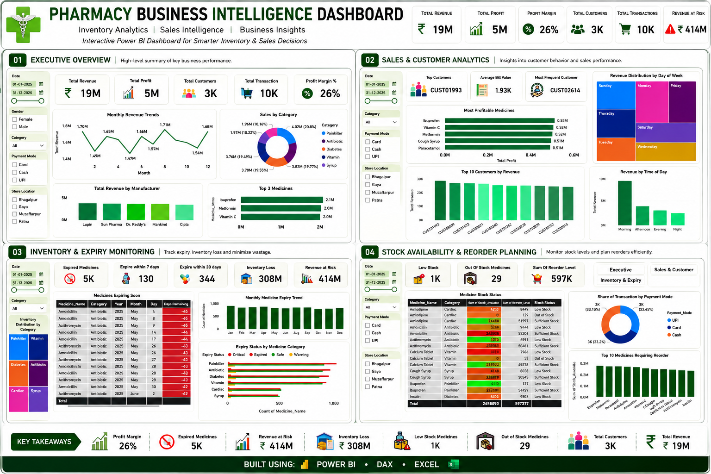
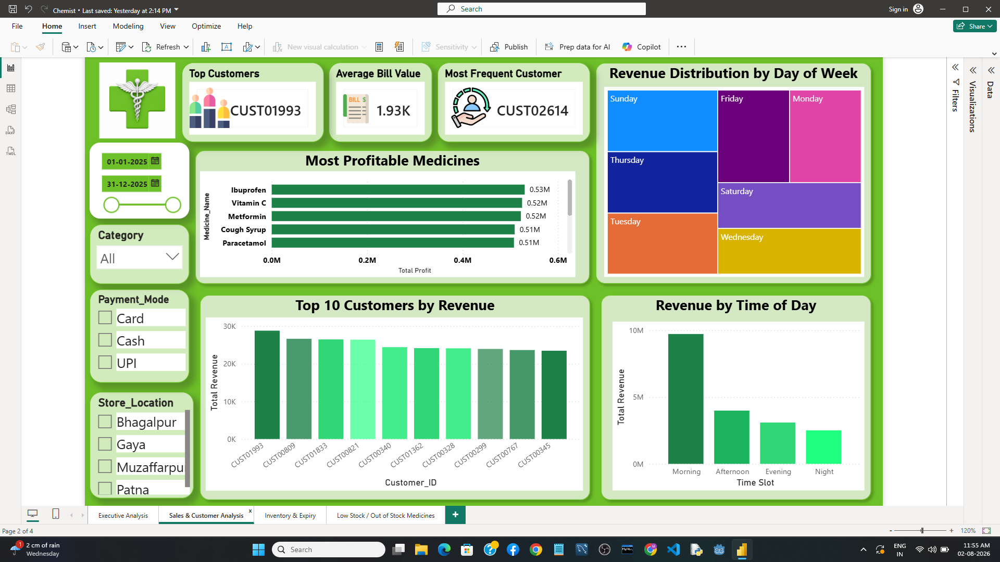
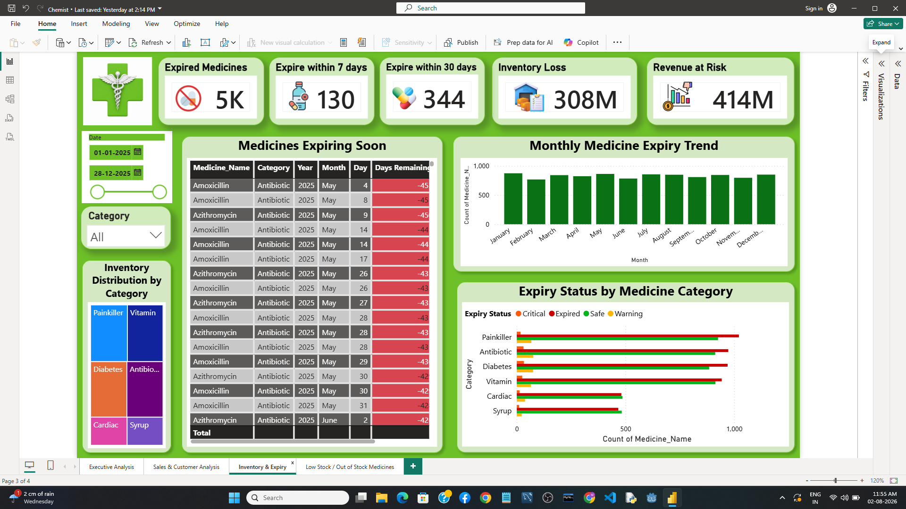
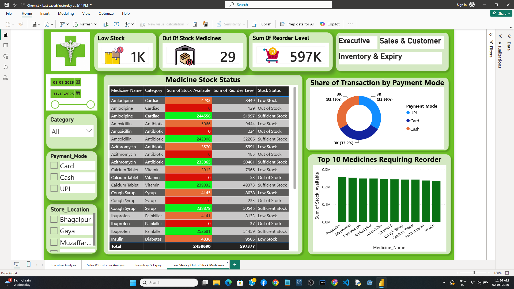

<div align="center">

# Pharmacy Business Intelligence Dashboard

### Inventory Analytics • Sales Intelligence • Business Intelligence

An interactive Power BI dashboard designed to help pharmacy businesses monitor inventory, reduce stock-outs, minimize medicine expiry losses, and support data-driven operational decision-making.


</div>

---

# Dashboard Preview

<p align="center">

</p>

---

# Project Highlights

- Interactive Power BI dashboard for pharmacy inventory and business monitoring.
- Tracks medicine expiry, stock availability, and reorder requirements.
- Identifies inventory risks and potential revenue loss.
- Analyzes sales performance, customer purchasing behaviour, and payment trends.
- Supports faster operational decision-making through KPI-driven dashboards.

---

# Table of Contents

- [Project Overview](#project-overview)
- [Business Problem](#business-problem)
- [Project Objectives](#project-objectives)
- [Dashboard Modules](#dashboard-modules)
- [Key Business Insights](#key-business-insights)
- [Business Recommendations](#business-recommendations)
- [Business Impact](#business-impact)
- [Tools & Technologies](#tools--technologies)
- [Skills Demonstrated](#skills-demonstrated)
- [Repository Structure](#repository-structure)
- [Future Improvements](#future-improvements)
- [Contact](#contact)

---

# Project Overview

Many pharmacy businesses manage sales and inventory using spreadsheets, making it difficult to monitor stock availability, medicine expiry, and overall business performance. This project demonstrates how Business Intelligence can transform operational data into actionable insights that support inventory planning, sales monitoring, and operational decision-making.

The dashboard consolidates inventory, sales, customer, and financial information into a single interactive reporting solution built with Power BI.

---

# Business Problem

Pharmacy businesses commonly face operational challenges such as:

- Medicines becoming out of stock before reorder decisions are made.
- Expired medicines increasing inventory losses.
- Limited visibility into medicines approaching expiry.
- Difficulty identifying high-demand medicines.
- Manual reporting and limited operational insights.

This dashboard addresses these challenges by providing centralized, real-time business visibility through interactive dashboards.

---

# Project Objectives

- Monitor inventory health and medicine availability.
- Track medicines approaching expiry.
- Identify low-stock and out-of-stock medicines.
- Support reorder planning using inventory insights.
- Analyze sales performance and customer purchasing behaviour.
- Provide executive-level KPIs for business monitoring.

---

# Dashboard Modules

## Executive Overview

<p align="center">

</p>

Provides a high-level overview of revenue, profit, customers, transactions, sales trends, and key business KPIs for executive decision-making.

---

## Sales & Customer Analytics

<p align="center">

</p>

Analyzes customer purchasing behaviour, payment trends, revenue patterns, top-performing medicines, and sales performance across different business dimensions.

---

## Inventory & Expiry Monitoring

<p align="center">

</p>

Tracks medicine expiry, inventory health, inventory loss, revenue at risk, and medicines approaching expiry to support proactive inventory management.

---

## Stock Availability & Reorder Planning

<p align="center">

</p>

Identifies low-stock and out-of-stock medicines, monitors reorder levels, and prioritizes medicines requiring immediate replenishment.

---

# Key Business Insights

| Business KPI | Value |
|--------------|------:|
| Total Revenue | ₹19 Million |
| Total Profit | ₹5 Million |
| Profit Margin | **26%** |
| Expired Medicines | **5,000** |
| Expiring within 7 Days | **130** |
| Expiring within 30 Days | **344** |
| Inventory Loss | ₹308 Million |
| Revenue at Risk | ₹414 Million |
| Low Stock Medicines | **1,000** |
| Out-of-Stock Medicines | **29** |
| Total Reorder Level | **597K Units** |

---

# Business Recommendations

- Prioritize replenishment of high-demand medicines including **Amoxicillin**, **Azithromycin**, and **Vitamin C**.
- Monitor medicines approaching expiry to reduce inventory loss.
- Maintain safety stock for frequently purchased medicines.
- Schedule periodic inventory reviews based on reorder levels.
- Utilize customer purchasing behaviour to optimize inventory planning and promotional strategies.

---

# Business Impact

The dashboard enables pharmacy businesses to:

- Improve inventory visibility.
- Reduce stock-out situations.
- Minimize losses caused by expired medicines.
- Support proactive inventory planning.
- Monitor business performance from a centralized dashboard.
- Enable faster and data-driven operational decision-making.

---

# Tools & Technologies

| Category | Technologies |
|-----------|--------------|
| Dashboard Development | Power BI |
| Data Source | Microsoft Excel |
| Data Transformation | Power Query |
| Data Modeling | DAX |
| Data Visualization | Power BI Visuals |

---

# Skills Demonstrated

- Business Intelligence
- Data Analytics
- Dashboard Design
- KPI Development
- Inventory Analytics
- Sales Analytics
- Customer Analytics
- Business Storytelling
- Data Visualization
- DAX
- Power Query
- Excel

---

# Repository Structure

```text
pharmacy-business-intelligence-dashboard/
│
├── dashboard/
│   └── Pharmacy_Business_Dashboard.pbix
│
├── data/
│   └── Pharmacy_Data.xlsx
│
├── images/
│   ├── dashboard_overview.png
│   ├── executive_dashboard.png
│   ├── sales_customer_dashboard.png
│   ├── inventory_expiry_dashboard.png
│   └── stock_reorder_dashboard.png
│
└── README.md
```

---

<details>

<summary><strong>Future Improvements</strong></summary>

- Demand Forecasting using Machine Learning
- Automated Inventory Alerts
- Supplier Performance Analytics
- ABC Inventory Analysis
- Forecast-based Reorder Planning
- Real-time Database Integration

</details>

---
